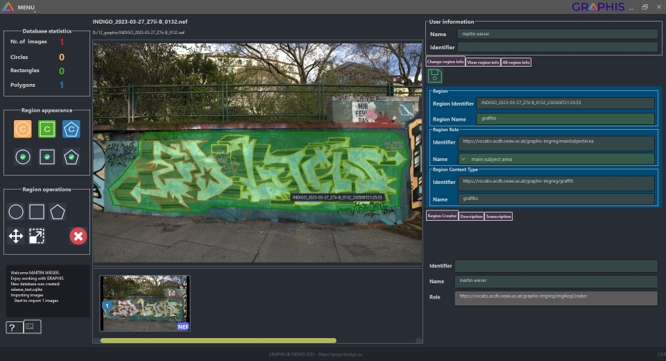

## Table of contents
* [General info](#general-info)
* [Install](#install)
* [Usage](#usage)


## General info
Since its [2019.1 version](https://www.iptc.org/std/photometadata/specification/IPTC-PhotoMetadata-2019.1.html), the IPTC Photo Metadata Standard has facilitated the creation of image regions: groupings of image pixels—defined by a circle, rectangle, or any other polygonal shape—which can be annotated with region-specific metadata.

GRAPHIS (<ins>G</ins>enerate <ins>R</ins>egions and <ins>A</ins>nnotations for <ins>PH</ins>otos using the <ins>I</ins>PTC <ins>S</ins>tandard) is an open-source and freely available Windows-based software to create or change IPTC image regions, annotate them with graffiti descriptions or transcriptions, and visualise them. The backend of GRAPHIS is programmed in [Python 3](https://www.python.org), while PySide—also known as [Qt for Python](https://wiki.qt.io/Qt_for_Python)—was used for the Graphical User Interface (GUI). In addition, GRAPHIS relies on many other pieces of software, of which the most prominent ones function as interfaces for data handling: [ExifTool](https://exiftool.org) to read and write photo metadata, the Python wrapper [rawpy](https://pypi.org/project/rawpy) for [LibRaw](https://www.libraw.org) to read the primary image pixels of RAW photo files, and the database engine [SQLite](https://www.sqlite.org) for intermediate data storage. Thanks to GRAPHIS' GUI, one does not need to know and understand how these separate software components operate. Finally, the [GRAPHIS Image Region vocabulary](https://vocabs.acdh.oeaw.ac.at/graphis-imgreg) provides GRAPHIS with a controlled list of concepts defined explicitly for graffiti image regions.

GRAPHIS supports the most common raster image file formats that store IPTC metadata: JPEG, TIFF, PNG, and many RAW formats. The metadata of all imported images are read and written into a local SQLite database; this database also stores each operation on the image regions. GRAPHIS can store the (newly created or altered) image regions and their annotations back into the original images at any time, but only if chosen so in the menu.
		
## Install
The latest compiled release—ready for direct installation on a Windows machine—can be found [here](https://github.com/GraffitiProjectINDIGO/GRAPHIS/releases).
One can also run ```pyinstaller Graphis_pyinstaller.spec``` to create an executable software package graphis_XX.

## Usage
GRAPHIS aims to add, manipulate, or visualise IPTC image regions. Only circles, rectangles, or any other valid polygonal shapes contained within the image are allowed. Additional meta information can be stored for each image region.
To create or alter an image region, the user should select one of the region operators with a left mouse click. With the circle and rectangle tools, drawing starts and ends with a right mouse click. Polygons are finished with a left click because every right click of the mouse creates a new vertex. Upon finishing the creation of a shape, its region boundary information gets automatically stored in the SQLite database, while the image region property gets default values that are defined in the graphis.config file (a text-based configuration file). Any change in geometry is immediately submitted to the underlying SQLite database, while metadata changes must be submitted with the green floppy disk icon.

When drawing a region, the last-used drawing tool remains active (indicated by its yellow icon), allowing the user to keep drawing with the same tool without activating it every time. Suppose metadata properties need to be added (like a description) or changed (like the region name) after drawing that region. In that case, the user can quickly save that new information with CTRL+S, avoiding a mouse click on the saving icon. The Enter and Backspace buttons allow navigation to the next or previous image. However, this will only work if the cursor is not on a metadata field, as one would otherwise start typing in that field. These features support the rapid creation of polygons with minimal mouse clicks. GRAPHIS also ensures that a region cannot be finalised if it partly lies outside the image boundaries. In addition, intersecting polygon edges are not allowed.

Once an image region has been created, it is possible to modify its shape in various ways using some of the tools provided by GRAPHIS. For example, circles and rectangles can be resized, while the same tool can also be used to move polygon vertices. Other tools allow the user to shift or delete the entire shape, or to add or remove individual polygon vertices. As with the drawing tools, a left mouse click activates these shape modification tools, while a right mouse click executes the action.

While currently only fixed metadata fields of the image region can be edited, all meta-information about the image regions can be shown with the tabs on the right side. The "View region info" tab displays all the properties of the selected region. The "All region info" tab lists all properties of every image region in the active image. In the last two tabs, properties can be expanded or collapsed at will.

Results can be saved directly inside the images or in a separate CSV file. Altering image regions outside of GRAPHIS while the SQLite database still holds image region metadata that are not written back into the image file will lead to errors.

Much more information can be found in the following publication, which users of GRAPHIS are also asked to cite:<br>
Verhoeven, G.J., Wieser, M., Carloni, M., 2023. <i>GRAPHIS—Visualise, Draw, Annotate, and Save Image Regions in Graffiti Photos</i>, in: <ins>disseminate | analyse | understand graffiti-scapes. Proceedings of the goINDIGO2023 international graffiti symposium</ins>, Vienna, Austria. 14-16 June 2023. Urban Creativity, Lisbon.



